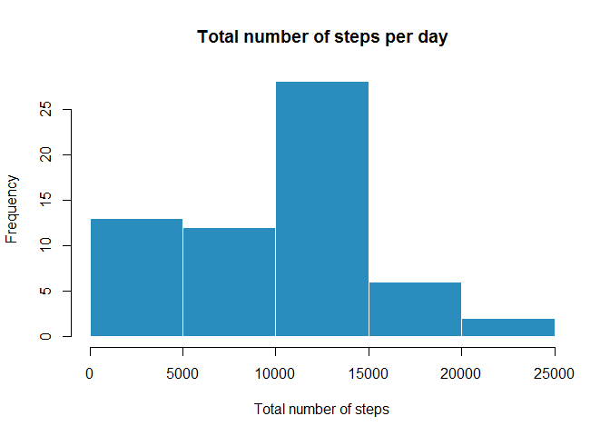
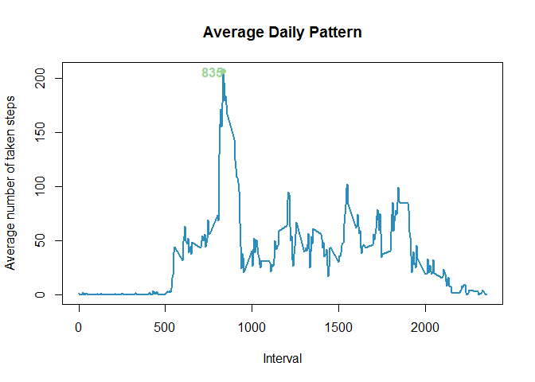
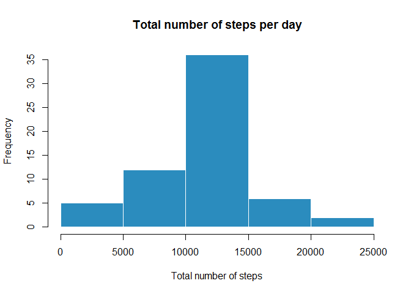
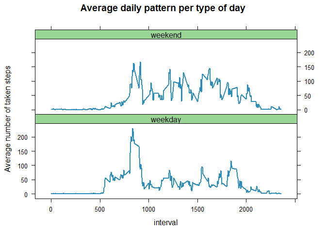

Activity monitoring data
========================

This assignment makes use of data from a personal activity monitoring
device.

This device collects data at **5 minute intervals** through out the day.
The data consists of two months of data from an anonymous individual
collected during the months of October and November, 2012 and include
the number of steps taken in 5 minute intervals each day.

### Loading and preprocessing the data

The activity data has been downloaded from
[here](https://d396qusza40orc.cloudfront.net/repdata%2Fdata%2Factivity.zip)
and stored in the working directory.

The variables included in this dataset are:

-   **steps**: Number of steps taking in a 5-minute interval (missing
    values are coded as NA)
-   **date**: The date on which the measurement was taken in YYYY-MM-DD
    format
-   **interval**: Identifier for the 5-minute interval in which
    measurement was taken

The dataset is stored in a comma-separated-value (CSV) file and there
are a total of 17,568 observations in this dataset.

The following code first loads the data from the Working Directory to
the **activityData** dataframe. It then converts the **date** column of
the dataframe to the Date format.

    activityData <- read.csv("./activity.csv")
    activityData$date <- as.Date(activityData$date)

### What is mean total number of steps taken per day?

For now, we will ignore the missing values in this dataset.

We first calculate the total number of steps per day and contruct a
histogram with the result.

    totalStepsperDay <- activityData %>% group_by(date) %>% summarize(totalSteps = sum(steps))
    hist(totalStepsperDay$totalSteps, xlab = "Total number of steps", col = "#2b8cbe", border = "white", main = "Total number of steps per day")

We can also compute the mean and the median of the total number of steps
taken each day.

    meanSteps <- format(mean(totalStepsperDay$totalSteps, na.rm = TRUE), digits = 7)
    medianSteps <- format(median(totalStepsperDay$totalSteps, na.rm = TRUE), digits = 7)

The mean is **10766.19** and the median **10765**. They are almost
equal.

### What is the average daily activity pattern?

To answer this question, we first group the data by interval. Then for
each interval, we compute the mean of the number of taken steps. This
will give us the dataframe **avgDailyPattern**, representing the average
daily pattern. We can also compute the maximum average and the interval
for which it is reached and store the coordinates in **maxInterval**.

    avgDailyPattern <- activityData %>% group_by(interval) %>% summarize(avg = mean(steps,na.rm = TRUE))
    maxInterval <- filter(avgDailyPattern, avg == max(avg))

The following plot displays the average number of taken steps per
interval, across all days. The green point represents the maximum, which
is reached for the interval **835**.

    with(avgDailyPattern, plot(interval, avg, type="l", xlab = "Interval", ylab = "Average number of taken steps", main = "Average Daily Pattern", col = "#2b8cbe", lwd = 2))
    points(maxInterval, pch = 19, col = "#99d594")
    text(x = maxInterval, labels = maxInterval$interval, col = "#99d594", adj = 1, font = 2)

Imputing missing values
-----------------------

In this step, we are trying to replace the missing values by suitable
values.

    numberNA <- count(filter(activityData, is.na(steps)))

There are **2304** missing values in this dataset.

We create another dataset, called **activityDataNoNA**, which will
contain the new data without NA values. We first merge the initial
dataset with the previously computed **avgDailyPattern** dataset, to
ensure easily retrieval of the average number of steps taken per
interval. We then use this value to replace the NA ones.

    activityDataNoNA <- merge(activityData,avgDailyPattern,all = TRUE)
    activityDataNoNA <- activityDataNoNA %>% mutate(steps = ifelse(is.na(steps),avg,steps))

Same as in the second question, we compute the total number of steps
taken per day, plot a histogram and then compute the mean and median.

    totalStepsperDayNoNA <- activityDataNoNA %>% group_by(date) %>% summarize(totalSteps = sum(steps))
    hist(totalStepsperDayNoNA$totalSteps, xlab = "Total number of steps", col = "#2b8cbe", border = "white", main = "Total number of steps per day")

    mean(totalStepsperDayNoNA$totalSteps)

    ## [1] 10766.19

    median(totalStepsperDayNoNA$totalSteps)

    ## [1] 10766.19

We now notice that the median has slightly changed, and is now equal to
the mean.

Are there differences in activity patterns between weekdays and weekends?
-------------------------------------------------------------------------

We want to compare the activity patterns between weekdays and weekends.

First, let's write the isWeekday() function, which returns "weekday" or
"weekend", depending on the date. We then use this function to add a new
column to the dataframe, representing the type of day and simply called
**day**. Lastly, this column is converted to Factor.

    isWeekday <- function(day) {
      if(weekdays(day) %in% c("samedi","dimanche")) 
        return("weekend") 
      else return("weekday")
    }

    activityDataNoNA <- activityDataNoNA %>% mutate(day = sapply(date,isWeekday))
    activityDataNoNA$day <- as.factor(activityDataNoNA$day)

After grouping the data by type of day and then by interval, we compute
the average number of steps taken per type of day and per interval. We
then plot the new dataframe with the lattice system.

    avgDailyPatternTypeOfDay <- activityDataNoNA %>% group_by(day,interval) %>% summarize(avg = mean(steps))
    xyplot(avg ~ interval | day, data = avgDailyPatternTypeOfDay, layout = c(1,2),type = "l", col = "#2b8cbe", lwd = 2, par.settings = list(strip.background=list(col="#99d594")), main = "Average daily pattern per type of day", ylab = "Average number of taken steps")

We notice that in the second half of a day, the activity is more
important during weekends then during weekdays.
